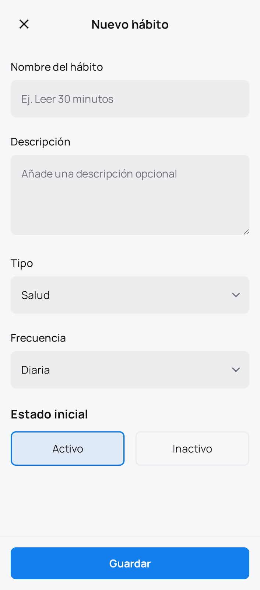
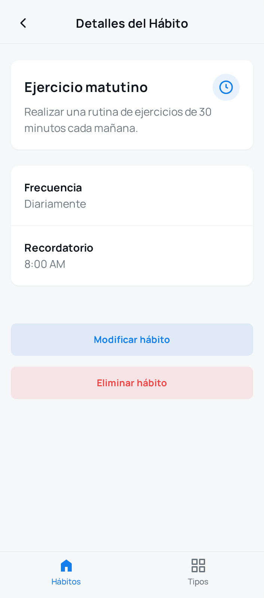
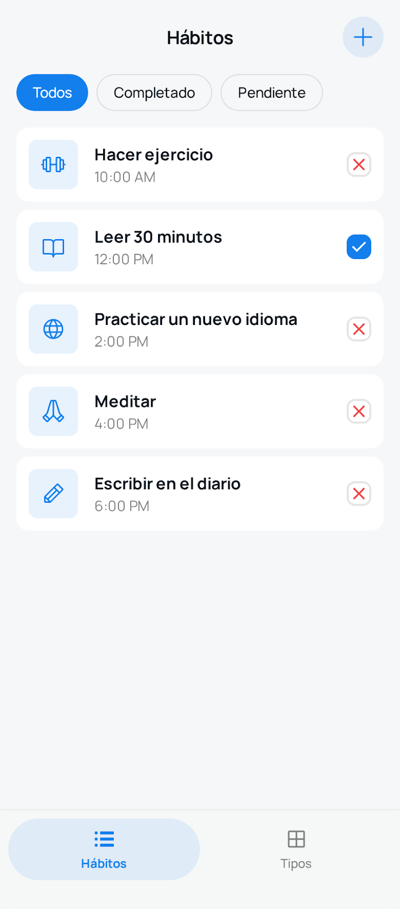
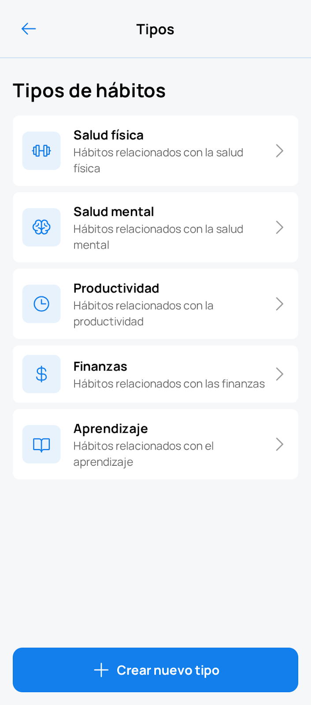

# Sesión 2: Primeros pasos con HabitApp

## Equipo

- Sergio Gómez Vico
- Adrián Martínez Granados
- Andrés Ruiz Andújar
- Raúl Martínez Gutiérrez

## Descripción

La aplicación que se va a desarrollar consiste en un **software de gestión de hábitos**, comúnmente conocido como “Habit Tracker”. La gestión de los hábitos no es algo nuevo ni tampoco es intrínseco al software, pero la informatización es una ayuda especialmente ventajosa en este aspecto, facilitando varias funciones. La app permite registrar los hábitos, clasificarlos y configurarlos, permitiendo realizarles un seguimiento. 

## Lista de funcionalidades básicas

Para el MVP, se tiene el siguiente conjunto de funcionalidades, consideradas como **esenciales**:

| Funcionalidad            | Descripción                              |
| ------------------------ | --------------------------------------------- |
| Listar hábitos           | Mostrar todos los hábitos registrados         |
| Clasificación de hábitos | Organizar por tipo, frecuencia o calendario   |
| Añadir hábitos           | Crear un nuevo hábito                         |
| Eliminar hábitos         | Borrar un hábito existente                    |
| Marcar estado hábito     | Indicar completado, pendiente o no completado |
| Editar hábitos           | Modificar detalles de un hábito               |
| Crear tipo de hábito     | Definir categorías o tipos de hábito          |

## Lista de funcionalidades adicionales

Como requisitos extra, que pueden interesar o no a diferentes usuarios, se redactan las siguientes:

| Funcionalidad                              | Descripción corta                         |
| ------------------------------------------ | ----------------------------------------- |
| Seguimiento cumplimiento de hábitos        | Ver progreso diario/semanal/mensual       |
| Calcular porcentaje de hábitos completados | Estadísticas de cumplimiento              |
| Descripción hábitos                        | Añadir texto descriptivo a cada hábito    |
| Notificaciones                             | Recordatorios automáticos                 |
| Añadir propiedad de evaluación de progreso | Medir avance en hábitos complejos         |
| Añadir notas sobre un hábito               | Registrar comentarios o reflexiones       |
| Previsualizar hábitos en calendario        | Vista de hábitos en formato calendario    |
| Obtención de logros al cumplir hábitos     | Recompensas por metas alcanzadas          |
| Compartir hábitos con amigos               | Función social / colaboración             |
| Calcular racha de un hábito                | Contador de días consecutivos completados |
| Añadir opción a widget                     | Acceso rápido desde pantalla principal    |
| Ranking en línea de hábitos compartidos    | Comparación con otros usuarios            |
| Foro para compartir impresiones            | Espacio para interacción y consejos       |
| Opciones de hábitos más habituales         | Estadísticas sobre hábitos frecuentes     |

## Prototipos

Se han creado prototipos para una aplicación móvil:

<figure>
  
  <figcaption>Figura 1: Añadir hábito</figcaption>
</figure>

<figure>
  
  <figcaption>Figura 2: Detalle de un hábito</figcaption>
</figure>

<figure>
  
  <figcaption>Figura 3: Lista de hábitos</figcaption>
</figure>

<figure>
  
  <figcaption>Figura 4: Tipos de hábitos</figcaption>
</figure>

