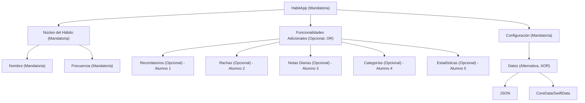

# Árbol de Características

## Listado de Características para la aplicación

- HabitApp (Mandatoria)
  - Núcleo del Hábito (Mandatoria)
    - Nombre (Mandatoria)
    - Frecuencia (Mandatoria)
  - Funcionalidades Adicionales (Grupo OR) - Se puede elegir una o más de las siguientes:
    - Recordatorios (Opcional) - Asignado al Alumno 1
    - Rachas (Streaks) (Opcional) - Asignado al Alumno 2
    - Notas Diarias (Opcional) - Asignado al Alumno 3
    - Categorías (Opcional) - Asignado al Alumno 4
    - Estadísticas (Opcional) - Asignado al Alumno 5
  - Configuración (Mandatoria)
    - Datos (Alternativa - XOR) - Se debe elegir exactamente una:
      - JSON
      - CoreData/SwiftData

## Diagrama en árbol

